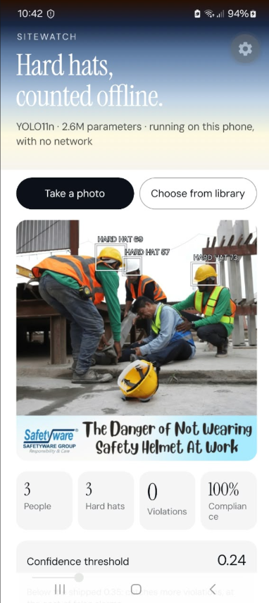

# Sitewatch Mobile

The [Sitewatch](https://github.com/direenvy/sitewatch) hard-hat detector, moved off the
server and onto an Android phone. No network calls, no API key, no round trip — a 10 MB
graph inside the APK, scoring photos on the phone's own CPU.

A construction site with no signal is exactly where a compliance check is most likely to
be needed. A detector that requires a round trip is a detector that does not work in a
basement.

---

## Why this is not just "the same model in an app"

The server build had PyTorch and Ultralytics doing a great deal of work either side of
the network. Neither exists on a phone. `onnxruntime-react-native` gives you a tensor in
and a tensor out; every convention Ultralytics applies silently has to be rebuilt by
hand, in TypeScript, and reproduced exactly — or the boxes land in the wrong place while
still looking plausible.

Three of those conventions, and what they cost to get wrong:

**Letterbox, don't stretch.** The model saw letterboxed images in training, so a
stretched one is out of distribution. The app scales by the smaller ratio and pads with
grey `114` — Ultralytics' fill value, not an arbitrary one — then undoes exactly that
transform on the way out.

**The head is in input pixels, channel-major.** Ultralytics exports YOLO11 detect as
`[1, 4 + nc, N]`: four box rows, then one row per class, already through sigmoid, with
`cx/cy/w/h` in pixels of the 320×320 input rather than normalised. Reading it row-major,
or assuming `0..1`, produces boxes that look reasonable and are wrong.

**There is no `getImageData`.** React Native cannot hand you pixels. The route that
works is native resize first (`expo-image-manipulator`), then base64, then a JPEG decode
in JavaScript. Order matters: decoding a 12-megapixel photo in pure JS would be ~36 MB of
RGBA and several seconds, so the image is downscaled natively before jpeg-js ever sees it.

**That ordering is necessary and it is not sufficient.** On the phone the decode still
costs **943 ms** against **192 ms** for the network itself. Resizing first was the right
call; assuming what remained would be cheap was not — see the measurements below.

## What export cost

Same held-out test split as the server build — 2,001 images, 5,518 boxes — scored three
ways.

| | PyTorch, 512 | ONNX, 512 *(shipped)* | ONNX, 320 |
|---|---|---|---|
| mAP50 | 0.9070 | **0.9042** | 0.8397 |
| mAP50-95 | 0.5501 | 0.5458 | 0.4902 |
| Precision | 0.8906 | 0.8814 | 0.8396 |
| Recall | 0.8518 | 0.8598 | 0.7928 |
| AP50 `hardhat` | 0.9163 | 0.9120 | 0.8418 |
| AP50 `no-hardhat` | 0.8976 | **0.8965** | 0.8376 |

**Export is nearly free: 0.003 mAP50.** Whatever the ONNX graph does differently from
PyTorch, it is not enough to matter, and `no-hardhat` — the class the product is judged
on — loses 0.001.

**Downscaling is not free, which is why the app ships 512.** 320 was the obvious choice
going in: half the pixels, 5 ms per frame against 12 on a desktop CPU. It costs 6.7
mAP50 points, and drops `no-hardhat` AP50 from 0.897 to 0.838 — roughly one violation in
twenty going unflagged, in exchange for about 7 ms. For an app that scores one photo on
a button press, nobody notices the milliseconds and somebody eventually notices the
missed violation. 320 stays exported in `model/` for a future live-video mode, where the
trade would be a real one.

Reproduce with `model/parity.py`, run from the Sitewatch checkout.

## Is the hand-written decoder actually right?

The TypeScript in `app/src/detect.ts` cannot run on a laptop, but its arithmetic can.
`app/tests/detect.test.ts` covers the pure functions directly — letterbox padding,
channel-major reads, coordinate round-trips, per-class suppression — by building a head
by hand from a known box and asserting the same box comes back out.

That catches syntax-level mistakes but not misread conventions, so there is a second
check: a line-for-line Python port of the same file, run against Ultralytics' own
predictions on real test photos. If the port agrees, the conventions are right and only
the JavaScript syntax is untested.

```
images                        40
boxes (port)                 114
boxes (ultralytics)          115
matched                      113
worst IoU on a matched pair  0.8988
largest score disagreement   0.0331
agreement                    98.3% of Ultralytics' boxes
```

Of the three boxes that did not pair: two scored **0.352** and **0.358**, within 0.01 of
the 0.35 threshold, and fell on opposite sides of it. The third is detected by the port
too — it just regressed to IoU **0.45** against Ultralytics' box, under the 0.5 pairing
gate, on the most crowded image in the sample.

None of that is a convention error. A misread layout, a normalisation that wasn't there,
or a letterbox undone in the wrong order all produce *systematically* displaced boxes,
and paired boxes here sit on top of each other to IoU 0.90 with scores agreeing to 0.03.
The residual is resampling: the port uses PIL where Ultralytics uses OpenCV, scores
differ in the third decimal, and anything sitting on the threshold can land either side.

Reproduce with `model/crosscheck.py`; output kept in `model/crosscheck.txt`.

## What it actually costs on a phone

Samsung Galaxy A52 (Snapdragon 720G, 2020 mid-range), one 600×600 photo:

| Stage | Time |
|---|---|
| **ONNX inference, 512×512** | **192 ms** |
| **JPEG decode in JavaScript** | **943 ms** |
| Total, shutter to boxes | ~1.14 s |

**The neural network is the fast part.** 192 ms on mid-range 2020 silicon against 12 ms
on a desktop CPU is about 16×, roughly what mobile-versus-desktop CPU should cost. A
2.6M-parameter detector running in under a fifth of a second on a phone, with no network,
is the claim this project set out to make, and it holds.

**The bottleneck is `jpeg-js`, at five times the cost of inference.** An earlier draft of
this README predicted "a few tens of milliseconds" for that step. That was wrong by about
thirtyfold, and the reason is instructive: React Native runs on **Hermes, which has no
JIT**, so a per-pixel loop over 262,144 pixels stays interpreted. The cost is not the
algorithm, it is the engine. Resizing natively first genuinely helps — the full-resolution
version would be seconds — but no amount of reordering makes an interpreted pixel loop
competitive with compiled code.

**The fix is a native decode**, handing the runtime a tensor built in C++ rather than one
assembled in JavaScript. That would plausibly put the pipeline near 250 ms and make a
live-video mode — hopeless now at under 1 fps — worth attempting at around 5, which is
why the 320×320 export is kept in `model/`.

What this means for the product as it stands: about a second per photo is perfectly
usable for a supervisor checking a site by taking pictures, and completely unusable for
anything continuous.

## Where it fails, and why that matters most

The first photo tried on a real phone was a stock image of a site injury: three workers
in hard hats helping a fourth who is sitting on the ground, head bowed, his own helmet
lying beside him. The app found the hard hats. **It did not find the bare head.**



The screenshot above is the app itself, on the phone, scoring that photo. Three boxes,
correctly placed. **People 3 · Hard hats 3 · Violations 0 · Compliance 100%** — and the
man sitting on the ground without a helmet, being helped by the other three, is not
counted as a person at all. The confidence threshold in that screenshot has been dragged
down to **0.24**, well below the shipped 0.35, and he still does not appear.

That is not a phone bug, a threshold choice or an export artefact, and it was worth
proving rather than assuming:

| | PyTorch 512 | PyTorch 640 | ONNX 512 (phone) |
|---|---|---|---|
| Hard hats found | 3 | 3 | 2–3 |
| **Bare heads found** | **0** | **0** | **0** |
| Best `no-hardhat` score anywhere | — | — | **0.039** |

The original PyTorch weights, on a desktop, at a reckless confidence of 0.05, also find
nothing. The strongest `no-hardhat` anchor in the whole image scores 0.039 against a
shipped threshold of 0.35 — not a near miss, an absence.

**Why.** He is seated, his head is bowed, and his own arm crosses his forehead. The
19,745 training images are overwhelmingly upright workers seen head-on or in profile at
working distance. A crouched figure with an occluded, downturned head is out of
distribution, and no threshold recovers a detection the network never made.

**Why this is the most important number in this README.** The headline mAP50 of 0.907 is
measured on a held-out split drawn from the *same* distribution as training. It is a real
number and it is not a promise about a photograph taken on a real site in an unusual
moment. And the class that failed here is `no-hardhat` — the safety-critical one. A
compliance tool that silently misses a violation is worse than one that reports nothing,
because this photo scores **100% compliance**: three workers, three hard hats, no
violations. The one man in danger is invisible to it.

So the honest description of this project is narrower than "hard-hat compliance
detection": it detects hard hats reliably, and detects their absence only in the postures
it was trained on. Closing that gap needs training data of people sitting, lying,
crouching and turned away — which is precisely the data a safety system most needs and
is least likely to have, because those photographs are of accidents.

There is one piece of good news buried in the failure. The phone agreed with the desktop
model exactly: same hard hats found, same bare head missed. After two layers of
hand-written reimplementation — letterboxing, head decoding and suppression in
TypeScript — the app reproduces the reference pipeline's behaviour on a photo neither had
seen. That is the field confirmation the unit tests and the Ultralytics cross-check could
only approximate.

## Running it

Requires an Expo **custom dev build** — Expo Go cannot load a native ONNX runtime.

```bash
cd app && npm install
```

```bash
npx expo prebuild --platform android --clean
```

```bash
npx expo run:android
```

## Repository layout

```
model/     the exported graphs and the parity measurement
app/       the Expo application
  src/detect.ts    letterbox, decode, NMS — the port of what Ultralytics does
  src/image.ts     pixels out of a photo, which React Native does not offer
  tests/           the arithmetic, tested without a phone
```

## Credits

Detector trained in [Sitewatch](https://github.com/direenvy/sitewatch) on the
[hard-hat detection dataset](https://huggingface.co/datasets/keremberke/hard-hat-detection)
by Roboflow Universe Projects (CC BY 4.0).
